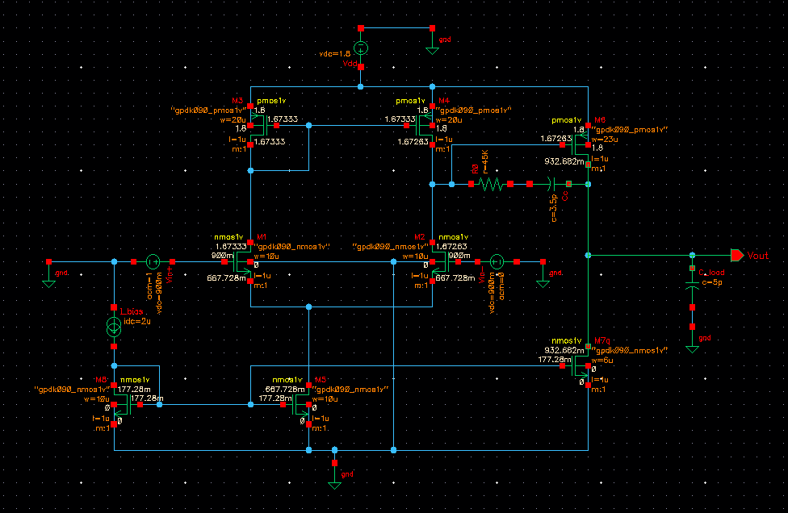
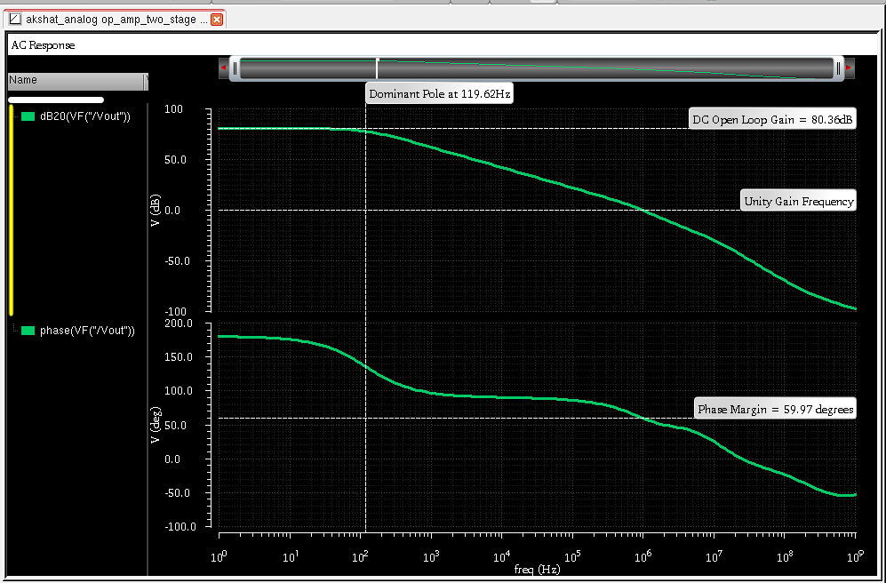
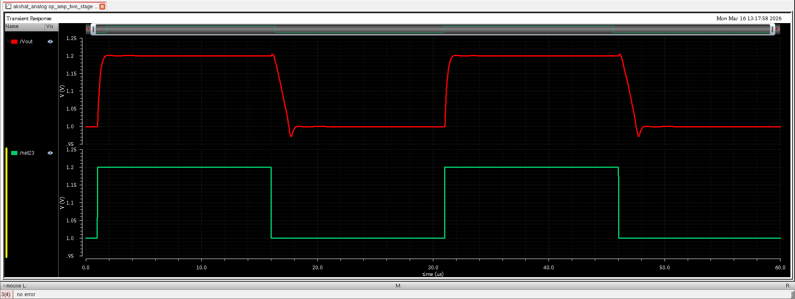

# Ultra-Low Power CMOS Op-Amp (gm/ID Methodology, 90 nm)

## 📌 Overview
This project presents the design of a two-stage CMOS operational amplifier using a gm/ID-driven methodology with weak-inversion biasing for ultra-low power applications.

## 🎯 Objective
To design an energy-efficient op-amp achieving high gain and stable operation across PVT variations with minimal power consumption.

## 🛠 Tools Used
- Cadence Virtuoso
- Spectre Simulator
- gpdk090 Technology

## ⚙️ Design Highlights
- gm/ID-based design methodology
- Weak inversion operation (gm/ID ≈ 27.5 V⁻¹)
- Two-stage CMOS architecture
- Miller compensation with nulling resistor

## 📊 Key Performance
| Parameter | Value |
|----------|------|
| Gain | 80.36 dB |
| Phase Margin | ~60° |
| UGB | 1.12 MHz |
| Power | 6.1 µW |
| CMRR | 88.8 dB |
| PSRR+ | 85.5 dB |

## 🔬 Key Insight
Weak-inversion biasing enables high transconductance at low current, resulting in improved energy efficiency while maintaining stability across PVT variations.

## 🧩 Design Approach
gm/ID selection → bias current → device sizing → compensation → PVT validation

## 🖼️ Results

### Schematic

### Bode Plot

### Transient Response

## 🚀 Applications
- Biomedical front-end circuits
- Low-power IoT systems
- Sensor interfaces

## 📄 Research Work
Prepared for conference submission
